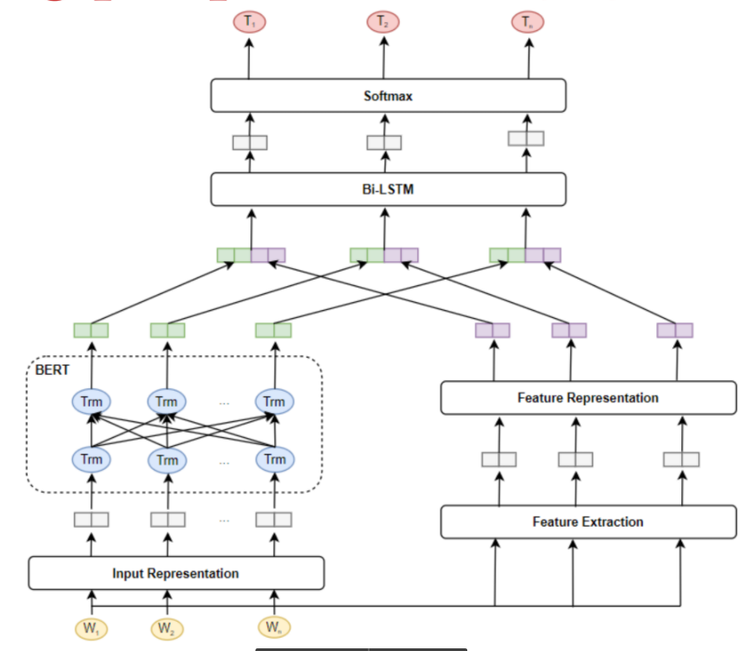

<h1 align="center">Vietnamese NER using BERT (bert-vn-ner)</h1>

Code by **Co Huy Khoa**.

## Introductions
Pytorch implementation of BERT models to perform named entity recognition (NER) for Vietnamese. Besides, the features in word are also used to represent words. This system using pretrained model from 
[transformers](https://github.com/huggingface/transformers)



## Installation
Requirements:
- Python 3.6+
- Pytorch 1.4+

Install dependencies:

`pip3 install -r requirements.txt`

## Dataset format
The input data's format of bert-vn-ner follows CoNLL-2003 format with four columns separated by a tab character, 
including of **word**, **pos**, **chunk**, and **named entity**. Each word has been put on a separate line and there is 
an empty line after each sentence. **Note that word segmentation is not used to match BERT's pretrain 
(bert-base-multilingual-cased)**. For details, see sample data in **'data'** directory. The table below describes an 
example Vietnamese sentence in dataset.

| Word      | POS | Chunk | NER   |
|-----------|-----|-------|-------|
|Dương	    |Np	  |B-NP	  |B-PER  |
|là	        |V	  |B-VP	  |O      |
|một	    |M	  |B-NP	  |O      |
|chủ       	|N	  |B-NP	  |O      |
|cửa    	|N	  |B-NP	  |O      |
|hàng	    |N	  |I-NP	  |O      |
|lâu	    |A	  |B-AP	  |O      |
|năm	    |N	  |B-NP	  |O      |
|ở	        |E	  |B-PP	  |O      |
|Hà  	    |Np	  |B-NP	  |B-LOC  |
|Nội	    |Np	  |I-NP	  |I-LOC  |
|.	        |CH	  |O	  |O      |

## Run the code
### Train
`python3 train.py --data_dir data/ --model_name_or_path bert-base-multilingual-cased --output_dir outputs --logs logs --cuda`

**Note**: file structure of the dataset
```text
├── data
|  └── train.csv
|  └── dev.csv
|  └── test.csv
```

## References
- [Google's BERT](https://github.com/google-research/bert)
- [HuggingFace's Transformers](https://github.com/huggingface/pytorch-transformers)
- [Underthesea](https://github.com/undertheseanlp/underthesea)
